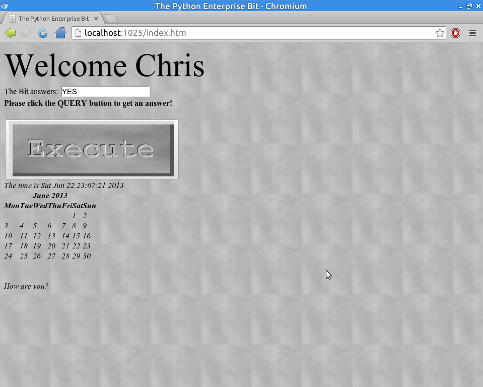

=============================
PyEBit: Python Enterprise Bit
=============================
++++++++++++++++++++++++++++++++++++++++++
Submission Entry for OMGWTF 2 Contestizion
++++++++++++++++++++++++++++++++++++++++++

PyEBit is a realization of a Bit from the film Tron. Bits are able to answer "yes" or "no" to questions.

PyEBit is robust and designed for enterprise use.

PyEBit uses your web browser to display its interface.

PyEBit is an example of how not to write Python code or programs in general. 

.. image:: https://travis-ci.org/chfoo/pyebit.png

Getting Started
===============

To run PyEBit, you will need:

* An Operating System
* A full installation of Python 3.2 or greater but strictly less than Python 4.0
* Python 3.3.1 on Ubuntu 13.04 3.8.0-19-generic x86_64 GNU/Linux is recommended but not required but suggested if problems occur
* TCP Ports 1025 and 1026 available
* A Mozilla compatible web browser built around 2013

.. Tip::
    Have your pen and paper ready to take down responses from PyEBit.

Installation
++++++++++++

PyEBit can be downloaded and run directly.

Start Up
++++++++

To start up PyEBit, simply run a similar command below::

    python -m pyebit "YOUR_NAME_HERE"

You may need to use ``python.exe`` or ``python3`` depending on your system. Be sure the package is in your path or the current directory contains the package directory.

Wait a while and your web browser should open up with the UI.

Shut down
+++++++++

Try pressing CTRL+C, or CTRL+Z, or CTRL+Break, or rebooting your operating system.

Details
=======

Description
+++++++++++

PyEBit is a Python 3 desktop app that uses the web browser to display its UI. The name is inspired from the Bit character from the film Tron. Bits are able to answer "yes" or "no" to questions.

Randomness Approach
+++++++++++++++++++

PyEBit uses a select set of numbers and runs several SHA512 hashes of them to produce a suitable seed. Values such as the disassembled bytecode of the random seed generating function is tossed into the process as well. It then uses the first byte of the digest to seed Python's built in random function.

UI Approach
+++++++++++

Since enterprise users are reluctant to using new software, displaying the UI through basic web pages should be familiar and welcoming. It probably took about an hour to get the UI and UX just right. No JavaScript but it dynamically updates! Plus, it binds to 0.0.0.0 so other users can use it as well.

Security Approach
+++++++++++++++++

All security issues will be addressed in Phase 2.

Screenshot
++++++++++

